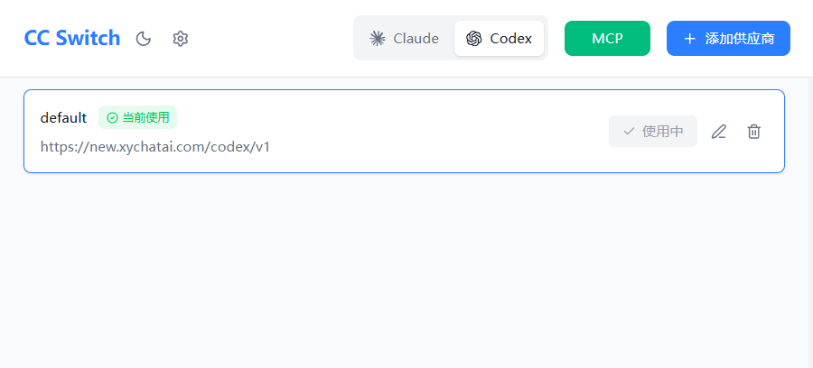
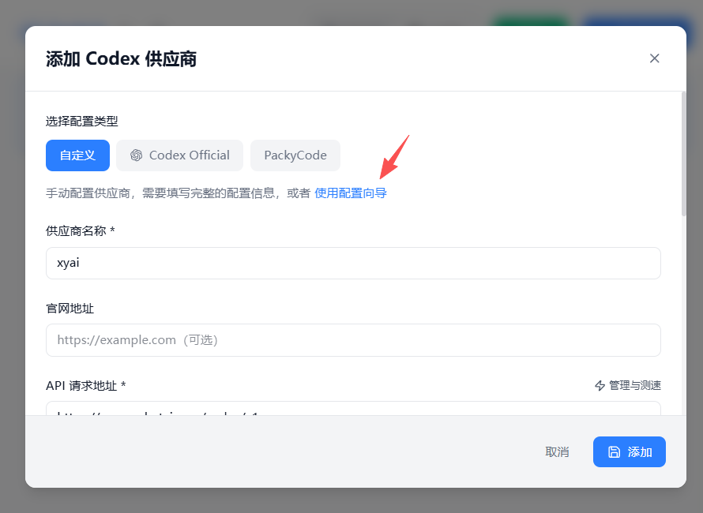
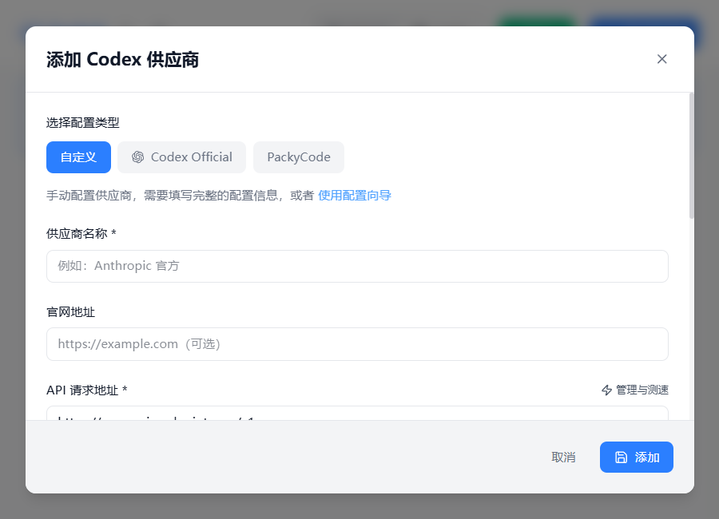

# Codex 配置 🔧

## 配置步骤

### 步骤 1：选择 Codex 分组

打开你下载的 CC Switch 软件，选择至 `Codex` 分组



### 步骤 2：添加供应商

选择**添加供应商**，建议使用**配置向导** ✨



#### 📋 配置向导模式（推荐）

您需要配置以下选项：

- **API 请求地址**：`https://new.xychatai.com/codex/v1`
- **API Key**：[点击前往 Vibe Code 控制台获取](https://new.xychatai.com/pastel/#/vibe-code?activeMenu=dashboard)



#### ⚙️ 手动配置模式

如需手动配置，需要准备以下文件：

- **API 请求地址**：`https://new.xychatai.com/codex/v1`
- **auth.json** - 填写 API Key
- **config.toml** - 填写模型配置

**auth.json 配置：**

在 `auth.json` 文件中填写您的 API Key。

**config.toml 配置：**

以下配置默认使用 `gpt-5.1-codex-max` 模型：

::: code-group
```toml [config.toml]
# 基础模型配置
model_provider = "codex"                    # 模型提供商
model = "gpt-5.1-codex-max"                 # 使用的模型版本
model_reasoning_effort = "high"             # 推理强度：low/medium/high
disable_response_storage = true             # 禁用响应存储

# Codex 供应商配置
[model_providers.codex]
name = "codex"                              # 供应商名称
base_url = "https://new.xychatai.com/codex/v1"  # API 基础地址
wire_api = "responses"                      # API 通信协议
env_key = "CODEX_API_KEY"                   # 环境变量 Key 名称

# 功能配置
[features]
web_search_request = true                   # 启用网络搜索功能

# 通知配置
[notice]
"hide_gpt-5.1-codex-max_migration_prompt" = true  # 隐藏迁移提示
```
:::

## 配置说明 📖

### 模型配置项

- `model_provider`: 指定使用的模型提供商（此处为 `codex`）
- `model`: 指定使用的模型版本（推荐使用 `gpt-5.1-codex-max`）
- `model_reasoning_effort`: 推理强度设置（可选：`low`、`medium`、`high`）
- `disable_response_storage`: 是否禁用响应存储

### 供应商配置项

- `base_url`: Codex API 的基础地址
- `wire_api`: API 通信协议类型
- `env_key`: 环境变量中的 API Key 名称

## 注意事项 ⚠️

- 🔑 请妥善保管您的 API Key，不要泄露给他人
- 🔄 配置修改后需要重启 Claude Code 才能生效
- 💰 使用 `max` 模型会消耗更多额度，请根据实际需求选择合适的模型
- 📊 可在 [Vibe Code 控制台](https://new.xychatai.com/pastel/#/vibe-code?activeMenu=dashboard) 查看使用情况和剩余额度

---

💡 如遇到问题，请参考 [常见问题文档](/faq.md) 或联系技术支持。
