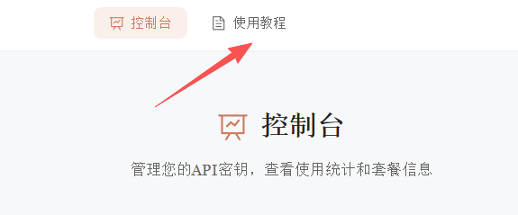

# 购买方式

首先在[站点](https://new.xychatai.com/)注册账号

- **站内购买**

选择合适的套餐后下单即可，付款后在左侧导航栏选择你需要的服务即可使用

- **兑换码兑换**

点击左上角**兑换码兑换**，如果兑换失败，请您稍等片刻再兑换一次

然后在左侧导航栏点击**vibecode**

首先进入的是**控制台**，后续您可以在这个页面**查看额度**与**使用情况**

点击**使用教程**，根据您使用的系统，选择运行脚本安装环境

> 1. 脚本会自动配置环境变量和API密钥
> 2. 配置完成后重启终端即可开始使用AI编程助手
> 3. 开始使用时，请一直回车确定，直到出现提示符

