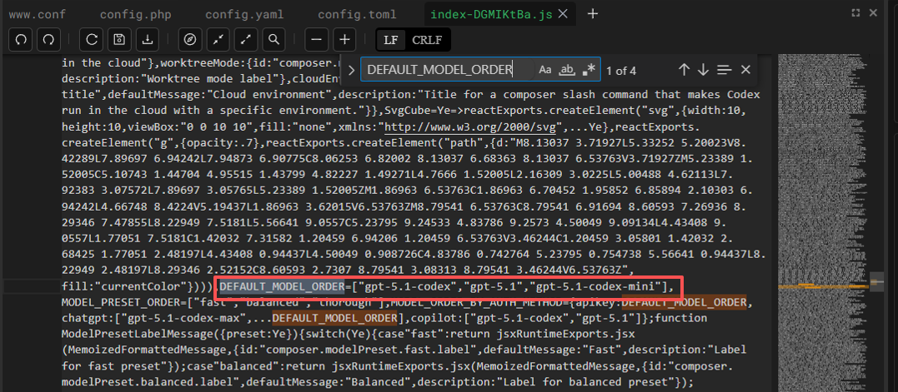

# 🚀Codex 快速上手指南 

## 💳购买方式 

首先在 [XyChat AI 站点](https://new.xychatai.com/) 注册账号。

### 站内购买

选择合适的套餐后下单即可，付款后在左侧导航栏选择你需要的服务即可使用。

### 兑换码兑换

点击左上角**兑换码兑换**，如果兑换失败，请您稍等片刻再重新兑换。

## ⚙️安装配置 

在左侧导航栏点击 **vibecode**，首先进入的是**控制台**，后续您可以在这个页面**查看额度**与**使用情况**。


点击**使用教程**，根据您使用的系统，选择一键配置脚本进行安装。

> 💡 **安装提示**
> 1. 脚本会自动配置环境变量和 API 密钥
> 2. 配置完成后重启终端即可开始使用 AI 编程助手

# max模型配置

## 终端使用

1.在终端里直接跑：

```
codex -m gpt-5.1-codex-max
```

2.配置为默认模型

找到 Codex 的配置文件（通常是）：

- `~/.codex/config.toml`

如果没有这个文件，就自己新建一个。

里面加上或修改这一行：

```
model = "gpt-5.1-codex-max"
```

保存之后，下次你直接跑：

```
codex
```

它就会默认用 `gpt-5.1-codex-max` 作为当前模型，再让你选推理档位。

3.在[cc-switch配置](./codex-switch)，也是相当于修改config.toml文件了

## VS Code 中启用 `codex-max` 模型

### Windows 环境 

**步骤 1：关闭 VS Code**

建议先完全退出 VS Code。

**步骤 2：打开插件目录**

找到 VS Code 插件目录，一般路径为：

::: code-group
```plaintext [📁 Windows 路径]
C:\Users\<你的用户名>\.vscode\extensions\openai.chatgpt-[版本号]\webview\assets\
```
:::

💡 `[版本号]` 是动态的，如 `0.15.0`，具体以实际安装版本为准

**步骤 3：编辑配置文件**

在该目录下找到类似 `index-ge9fmYMM.js` 的文件，用 VS Code 或任意文本编辑器打开。

**步骤 4：搜索配置项**

在文件中搜索 `DEFAULT_MODEL_ORDER`，可以看到类似：

::: code-group
```javascript [index-*.js (原始配置)]
DEFAULT_MODEL_ORDER=["gpt-5.1-codex","gpt-5-codex","gpt-5.1","gpt-5"]
```
:::


**步骤 5：添加 max 模型**

在数组末尾追加 `gpt-5.1-codex-max`，有两种配置方式：

::: code-group
```javascript [方式 1: 添加到末尾]
DEFAULT_MODEL_ORDER=[
  "gpt-5.1-codex",
  "gpt-5-codex",
  "gpt-5.1",
  "gpt-5",
  "gpt-5.1-codex-max"  // ← 新增的 max 模型
]
```

```javascript [方式 2: 置顶显示（推荐）]
DEFAULT_MODEL_ORDER=[
  "gpt-5.1-codex-max",  // ← max 模型排在第一位
  "gpt-5.1-codex",
  "gpt-5-codex",
  "gpt-5.1",
  "gpt-5"
]
```
:::

**步骤 6：重启 VS Code**

保存文件后，重新打开 VS Code，或者在扩展面板里**禁用再启用** OpenAI ChatGPT 插件。

**步骤 7：验证配置**

打开模型选择列表，就可以看到 `gpt-5.1-codex-max` 了。

---

### 🍎Linux / macOS 环境 

由于不同平台/发行版打包方式不一样，有时候前端资源路径不完全相同，如果你找不到固定路径，可以这样操作：

**步骤 1：搜索配置文件**

直接在 VS Code 的配置目录中搜索 `DEFAULT_MODEL_ORDER`：

打开终端，进入 VS Code 配置/扩展目录：

::: code-group
```bash [Terminal]
# 进入 VS Code 配置目录
cd ~/.vscode
```
:::

然后搜索配置项：

::: code-group
```bash [ripgrep (推荐)]
# 使用 ripgrep 搜索 - 速度快
rg "DEFAULT_MODEL_ORDER" -n .
```

```bash [grep (通用)]
# 使用 grep 搜索 - 通用方式
grep -R "DEFAULT_MODEL_ORDER" -n .
```
:::

**步骤 2：编辑配置文件**

找到包含 `DEFAULT_MODEL_ORDER` 的 `index-*.js` 文件后，用编辑器打开，原始内容大致为：

::: code-group
```js
DEFAULT_MODEL_ORDER=["gpt-5.1-codex","gpt-5-codex","gpt-5.1","gpt-5"]
```
:::



**步骤 3：添加 max 模型**

同样在数组中追加 `gpt-5.1-codex-max`：

::: code-group
```javascript [index-*.js (修改后)]
DEFAULT_MODEL_ORDER=[
  "gpt-5.1-codex",
  "gpt-5-codex",
  "gpt-5.1",
  "gpt-5",
  "gpt-5.1-codex-max"  // ← 新增
]
```
:::

**步骤 4：重启 VS Code**

保存后，重新启动 VS Code，或在扩展面板中禁用再启用 codex 插件。

---

### 如果重启后列表里还是看不到 max 模型 

有时候前端的模型列表不会立刻刷新，可以按下面步骤"激活"一下：

1. 先随便选择一个已经存在的模型（例如 `gpt-5.1-codex`）

2. 在对话框里输入一句简单的话，比如：`你好`

3. 再次打开模型选择列表，检查是否已经出现 `gpt-5.1-codex-max`

4. 若此时出现，就说明修改已生效，可以正常使用 `max` 模型了 

---

## 注意事项 

- **插件更新**：插件更新后，`index-*.js` 可能会被覆盖，需要重新修改一次
- **进阶配置**：这是通过修改插件打包前端资源的进阶玩法，如果未来插件内部实现变更，理论上有可能失效
-  **版本兼容**：如果搜索不到 `DEFAULT_MODEL_ORDER`，说明插件版本结构可能已经改了，需要根据最新版本的实现再找对应的配置点

---

💡 如遇到问题，请参考 [常见问题文档](/faq.md) 或联系技术支持。

