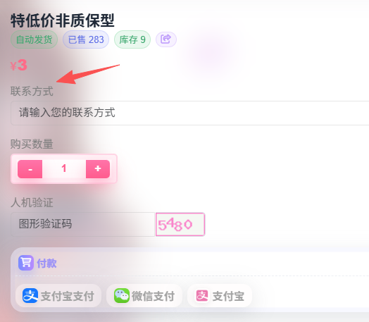

# team自助邀请

## 质保类型介绍

|   质保类型    |                           使用说明                           |
| :-----------: | :----------------------------------------------------------: |
|  10元质保型   | 当出现空间已停用等提示俗称`翻车`时，可以去[站点](https://new.xychatai.com/pastel/#/custom/1)解绑重新兑换 |
| 4.99元非质保  |  这个就是使用多长时间看运气了，只用一两天就翻车了也是可能的  |
| 3元特价非质保 | 这个是给codex使用的母号号池退换下来回血的，也是使用时间看运气 |

## 自助绑定

您需要准备一个chatgpt的普通账号

在[xyai的小铺](https://newshop.xychatai.com/cat/recommend)购买卡密，然后在[team自助邀请](https://new.xychatai.com/pastel/#/custom/1)中兑换，绑定邮箱即可

**质保卡密**可以在翻车后进行自助换绑

**解绑**后使用同一个兑换码重新绑定即可。

当提示`暂无可用母号..`时，可以在用户群里发一下，站长看到会补号，当然可能他活干完了但是没通知，现在会有客服盯一下的，请佬友们耐心等待。

  💡 温馨提示：兑换码的有效期为三天，为了让更多的佬可以可以用到，大家尽量不要囤兑换码

## 兑换码丢失

在xyai小铺下单时，会强制您留一个联系方式，如图

您拿着这个**联系方式**去左上角的[订单查询](https://newshop.xychatai.com/user/index/query)，输入后可以查询到您的兑换码

## 售后服务

如果不小心忘记使用，可以联系站长进行退款，您需要提供

1. 用户名

2. 付款截图
3. 计算好的剩余价值（如果有的话）

然后耐心等待站长的回复即可。